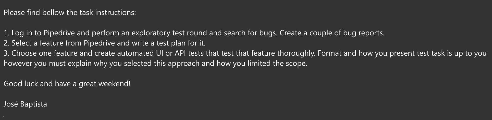
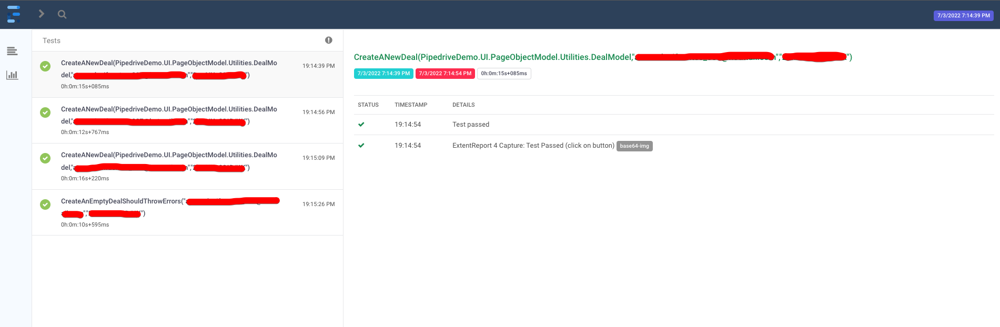
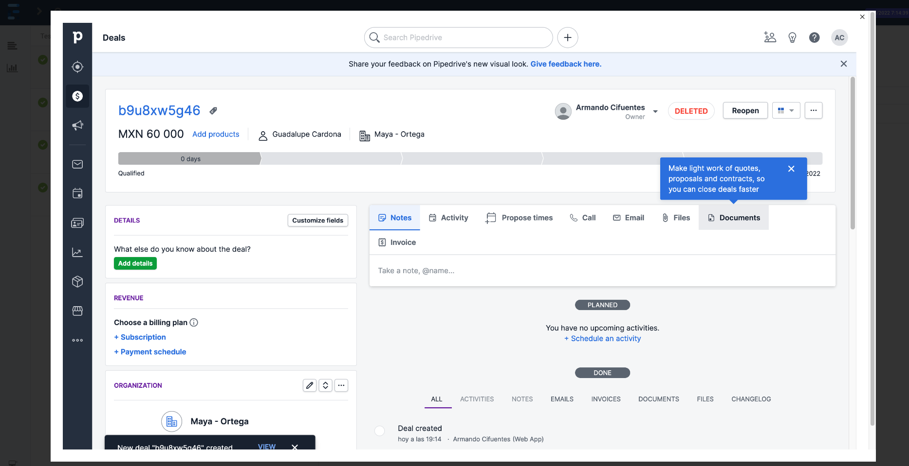

# Pipedrive Demo assessment

A technical assessment for the **Software Engineer in Test** position.

## The project 💻

The following project was made using *C#*, *NUnit*, *Selenium* and *Extent Reports*. This was the assessment.-



Review the overall test plan [here](https://github.com/ArCiGo/PipedriveDemo/blob/master/Assessment.%20Test%20Plan%20(Pipedrive).pdf), and [here](https://github.com/ArCiGo/PipedriveDemo/blob/master/Automation.%20Test%20Plan%20(Pipedrive).md) the test plan for the automation framework. Bug report can also be found [here](https://github.com/ArCiGo/PipedriveDemo/blob/master/Assessment.%20Bug%20reports%20(Pipedrive).pdf)

## Tools ⚙️

* *Visual Studio Code for Mac (v17.0.5 (build 6))*.
* *C# (.NET Core 6.0.301, C# v10.0)*.
* *NUnit v3.13.3*.
* *NUnit3TestAdapter v4.2.1*.
* *Selenium.Support v4.3.0*.
* *Selenium.WebDriver v4.3.0*.
* *DotNetSeleniumExtras.WaitHelpers v3.11.0*.
* *Selenium WebDriver GeckoDriver v0.31.0.1*
* *ExtentReports v4.1.0*.

## Project structure 🗂️

```xml
|---- PipedriveDemo
    |---- Tests
        |---- Data
        |---- UI
            |---- AutomationResources
        |---- Utilities
    |---- UI
        |---- PageObjectModel
            |---- Components
                |---- DealsDashboard
                |---- DealsItem
                |---- Home
                |---- Login
            |---- Pages
            |---- Utilities
```

## Setup 🛠️

I developed the code using a Mac, but it should work on a PC.

> .NET Core 3.1, or higher, is required to run the project.

The following steps can be executed using a terminal (I use [hyper](https://hyper.is/)).

1. Clone the repo.-

```shell
git clone https://github.com/ArCiGo/PipedriveDemo
```

2. In the **Data/Mocks.cs** class, update the lines 25, 34 and 47 with your email and password (respectively). In the **PipedriveDemoTests.cs** class, update the line 44 with your email and password (repectively).

3. Install the packages
```shell
dotnet build
```

## Run the tests

```shell
# Run all tests
dotnet test
```

```shell
# Running the tests by category

# UI tests
dotnet test --filter TestCategory=UI
```

When you execute the tests, a new folder is generated at the workspace root (*UIReports*). Inside of the folder, you will notice a new folder with the report (index.html). You can open them using your favorite browser.



